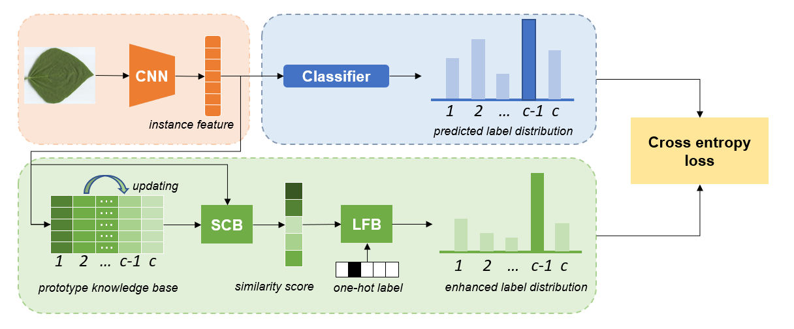

# PEL：Leaf Cultivar Identification via Prototype-enhanced Learning

Official PyTorch implementation of [Leaf Cultivar Identification via Prototype-enhanced Learning](https://arxiv.org/abs/2305.03351)

If you use the code in this repo for your work, please cite the following bib entries:

    @misc{zhang2023leaf,
      title={Leaf Cultivar Identification via Prototype-enhanced Learning}, 
      author={Yiyi Zhang and Zhiwen Ying and Ying Zheng and Cuiling Wu and Nannan Li and Jun Wang and Xianzhong Feng and Xiaogang Xu},
      year={2023},
      eprint={2305.03351},
      archivePrefix={arXiv},
      primaryClass={cs.CV}
}

## Abstract

 Leaf cultivar identification, as a typical task of ultra-fine-grained visual classification (UFGVC), is facing a huge challenge due to the high similarity among different varieties. In practice, an instance may be related to multiple varieties to varying degrees, especially in the UFGVC datasets. However, deep learning methods trained on one-hot labels fail to reflect patterns shared across categories and thus perform poorly on this task. As an analogy to natural language processing (NLP), by capturing the co-relation between labels, label embedding can select the most informative words and neglect irrelevant ones when predicting different labels. Based on this intuition, we propose a novel method named Prototype-enhanced Learning (PEL), which is predicated on the assumption that label embedding encoded with the inter-class relationships would force the image classification model to focus on discriminative patterns. In addition, a new prototype update module is put forward to learn inter-class relations by capturing label semantic overlap and iteratively update prototypes to generate continuously enhanced soft targets. Prototype-enhanced soft labels not only contain original one-hot label information, but also introduce rich inter-category semantic association information, thus providing more effective supervision for deep model training. Extensive experimental results on 7 public datasets show that our method can significantly improve the performance on the task of ultra-fine-grained visual classification. 

## Dataset
You can download the datasets from the links below:

+ [SoyLocal, SoyGlobal, SoyGene, SoyAge, and Cotton](https://pan.baidu.com/s/1bPJYmFGWJg2eTr5Ipfw6uA). Access code: iccv
+ [SoyCultivar200](https://drive.google.com/file/d/1XsWZPYYrDsCwAy5r4t3I1F_lOOrGGhgf/view)
+ [Sweet cherry](https://github.com/WeizhenLiuBioinform/mfcis)

## Run the experiments
Run train.py to train the model, e.g., train on the Cotton dataset with resnet50.

    $ python train.py -a resnet50 --feat_dim 2048 --epoch 120 --dataset cotton80 --save True --proto_path *.np
  
Run train.py to train the model, e.g., train on the Cotton dataset with DenseNet121.

    $ python train.py -a DenseNet121 --feat_dim 1024 --epoch 120 --dataset cotton80 --save True --proto_path *.np
